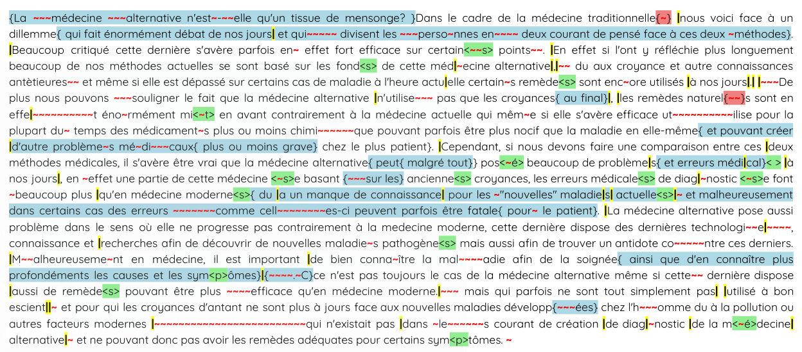

# Analyse de données d'écriture en temps réel

## Introduction

Ce dépôt contient les scripts ayant servi au projet ANR pro text d'analyse automatique de données d'écriture en temps réel.
Les scripts préfixés par "run_" sont des scripts exécutables. Les scripts suffixés par "_lib" sont des scripts appelés par les scripts exécutables.

Il y a 2 script exécutables :

1. run_pos_tagger.py
2. run_reconstruction_textes_annotes.py


## run_pos_tagger.py

Le script `run_pos_tagger.py` permet d'identifier les erreurs et de les annoter en parties du discours. Cela permet d'obtenir un fichier csv contenant une liste des productions contenant des erreurs.

Commande pour lancer l'outil :
```sh
python3 run_pos_tagger.py -i chemin/vers/le/fichier_tsv_contenant_les_donnees_originales -o chemin/vers/le/fichier_csv_de_resultats
```

Exemple de lancement :
```sh
python3 run_pos_tagger.py -i CLEAN_csv_planification.tsv -o annotation_erreurs_treetagger.csv
```

Le fichier csv de sortie servira à la reconstruction des textes avec les erreurs.


## run_reconstruction_textes_annotes.py

Le script `run_reconstruction_textes_annotes.py` permet de reconstruire les textes tapés par les participants tout en conservant l'annotation de leurs faits et gestes.

Commande pour lancer l'outil :
```sh
python3 run_reconstruction_textes_annotes.py -d chemin/vers/le/fichier_tsv_contenant_les_donnees_originales -e chemin/vers/le/fichier_csv_obtenu_avec_pos_tagger
```

Exemple de lancement :
```sh
python3 run_reconstruction_textes_annotes.py -d CLEAN_csv_planification.tsv -e annotation_erreurs_treetagger.csv
```

Après lancement du script, vous obtiendrez un dossier "Textes_reconstruits" contenant un fichier par participant. Chaque fichier correspond au texte que le participant a tapé, avec les annotations.




#### Légende des annotations :

- "|" : marque une pause entre deux productions
- "~" : marque un caractère qui a été supprimé
- "<>" : lettre, espace, ou ponctuation inséré(e) a posteriori dans le texte existant
- "{}" : mot ou séquence de mots inséré(es) a posteriori dans le texte existant

