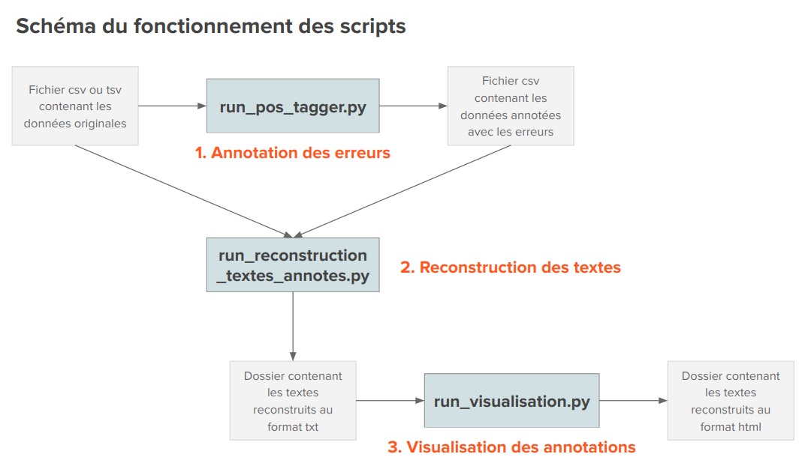
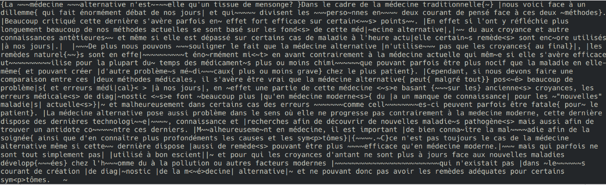

# Analyse de données d'écriture en temps réel

## Introduction

Ce dépôt contient les scripts ayant servi au projet ANR pro text d'analyse automatique de données d'écriture en temps réel. Ils constituent le prépraitement des données nécessaire avant le chunking.
Les scripts préfixés par "run_" sont des scripts exécutables. Les scripts suffixés par "_lib" sont des scripts appelés par les scripts exécutables.

Il y a 3 script exécutables, correspondant à trois étapes de traitement des données :

1. Annotation des erreurs : `run_pos_tagger.py`
2. Reconstruction des textes avec conservation des phénomènes d'écriture : `run_reconstruction_textes_annotes.py`
3. Visualisation des textes annotés avec des couleurs : `run_visualisation.py`




## 1. Annotation des erreurs : `run_pos_tagger.py`

Le script `run_pos_tagger.py` permet d'identifier les erreurs et de les annoter en parties du discours. Cela permet d'obtenir un fichier csv contenant une liste des productions contenant des erreurs.

Commande pour lancer l'outil :
```sh
python3 run_pos_tagger.py
```

Il vous demandera alors le nom du fichier contenant les données originales :
```txt
Nom du fichier csv ou tsv contenant les données :
```
Tapez le nom du fichier puis appuyez sur la touche `Entrée`.

Il vous demandera ensuite le nom du fichier dans lequel vous souhaitez sauvegarder le résultat de l'annotation des erreurs :
```txt
Nom du fichier csv pour sauvegarder l'annotation des erreurs :
```
Tapez le nom du fichier puis appuyez sur la touche `Entrée`.
Ce fichier csv de sortie servira à la reconstruction des textes. Conservez-le précieusement !


## 2. Reconstruction des textes avec conservation des phénomènes d'écriture : `run_reconstruction_textes_annotes.py`

Le script `run_reconstruction_textes_annotes.py` permet de reconstruire les textes tapés par les participants tout en conservant l'annotation de leurs faits et gestes (pauses, suppressions, insertions, etc.).

Commande pour lancer l'outil :
```sh
python3 run_reconstruction_textes_annotes.py
```

Il vous demandera alors le nom du fichier contenant les données originales (non annotées) :
```txt
Nom du fichier csv ou tsv contenant les données non annotées :
```
Tapez le nom du fichier puis appuyez sur la touche `Entrée`.

Il vous demandera ensuite le nom du fichier contenant l'annotation des erreurs (obtenu avec `run_pos_tagger.py`) :
```txt
Nom du fichier csv contenant les données avec l'annotation des erreurs :
```
Tapez le nom du fichier puis appuyez sur la touche `Entrée`.

Après lancement du script, vous obtiendrez un dossier "Textes_reconstruits" contenant un fichier par participant. Chaque fichier correspond au texte que le participant a tapé, avec les annotations.




#### Légende des annotations :

- "|" : marque une pause entre deux productions
- "~" : marque un caractère qui a été supprimé (autant de ~ que de caractères supprimés)
- "<>" : caractère unique (lettre, espace, ou ponctuation) inséré a posteriori dans le texte existant
- "{}" : séquence de plusieurs caractères (partie de mot, mot complet ou suite de mots) insérée a posteriori dans le texte existant


## 3. Visualisation des textes annotés avec des couleurs : `run_visualisation.py`

Le script `run_visualisation.py` permet de transformer les fichiers txt des textes reconstruits obtenus avec `run_reconstruction_textes_annotes.py` en fichiers html où les annotations sont rendues plus visibles et ainsi mieux observables avec l'application de styles. Cette étape n'est pas nécessaire au traitement dans le but du chunking puisque ce sont les fichiers txt qui seront fournis en input du chunking. Néanmoins, elle permet de mieux comprendre les annotations avec une représentation plus attractive.

Commande pour lancer l'outil :
```sh
python3 run_visualisation.py
```

Il vous demandera alors le nom dossier contenant les textes reconstruits (obtenu avec `run_reconstruction_textes_annotes.py`) :
```txt
Nom du dossier contenant les textes reconstruits :
```
Tapez le nom du dossier puis appuyez sur la touche `Entrée`.

Les nouveaux fichiers html seront enregistrés dans le dossier "Textes_reconstruits_visualisation".

Voici un exemple de fichier html obtenu :


#### Rappel de la légende des annotations :

- "|" : marque une pause entre deux productions
- "~" : marque un caractère qui a été supprimé (autant de ~ que de caractères supprimés)
- "<>" : caractère unique (lettre, espace, ou ponctuation) inséré a posteriori dans le texte existant
- "{}" : séquence de plusieurs caractères (partie de mot, mot complet ou suite de mots) insérée a posteriori dans le texte existant

